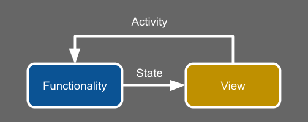
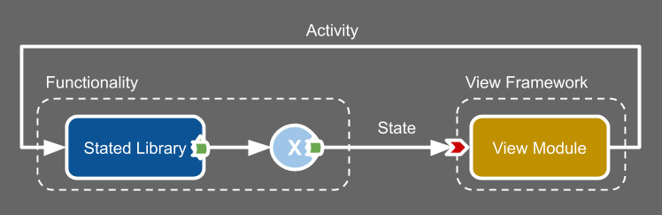
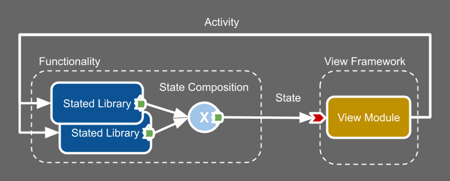
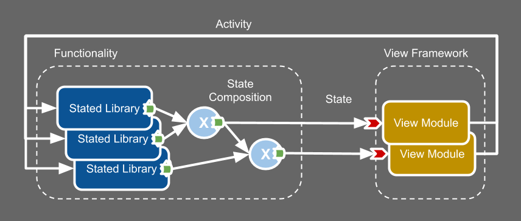
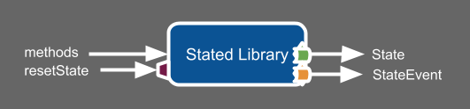
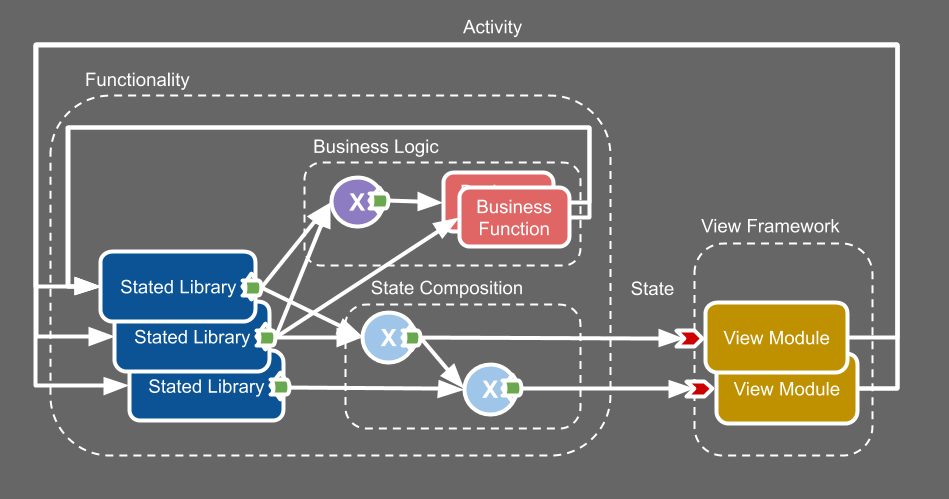
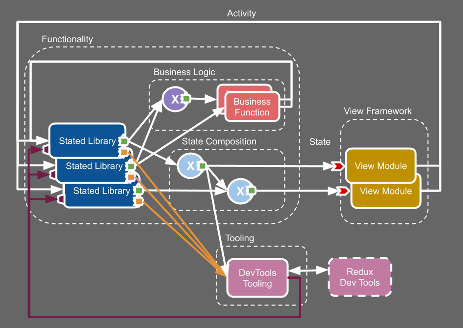

# :dart: Stated Libraries
**An _Alternative_ to State Management**

 [![Build Status][build-badge]][build] [![Code Coverage][coverage-badge]][coverage] [![PRs welcome][prs-welcome-badge]][prs] [![License][license-badge]][license] ![Types][types-badge]

[build]: https://dev.azure.com/bradfordlemley/stated-library/_build/latest?definitionId=1&branchName=master

[build-badge]: https://img.shields.io/azure-devops/build/bradfordlemley/stated-library/1/master.svg

[coverage]: https://codecov.io/github/bradfordlemley/stated-library/branch/master

[coverage-badge]: https://img.shields.io/codecov/c/gh/bradfordlemley/stated-library/master.svg

[coverage-badge-az]: https://img.shields.io/azure-devops/coverage/bradfordlemley/stated-library/1/master.svg

[license-badge]: https://img.shields.io/github/license/bradfordlemley/stated-library.svg

[license]: https://github.com/bradfordlemley/stated-library/blob/master/LICENSE

[prs]: https://github.com/bradfordlemley/stated-library/pulls

[prs-welcome-badge]: https://img.shields.io/badge/PRs-welcome-brightgreen.svg

[types-badge]: https://img.shields.io/npm/types/typescript.svg

**The Problem:** The real purpose of "State Management" solutions, like Redux, is to implement functionality.  But, functionality doesn't fit cleanly into state, so "State Management" solutions end up inventing convoluted contraptions, like middleware, to achieve functionality.  And we end up developing application functionality using these convoluted contraptions, with our hands tied behind our backs.  It all requires extra brain cycles, extra code, extra time...sloooowing down development.

**The Solution:** Focus on implementing functionality, not managing state.  _Functionality naturally produces state_, no convoluted contraptions required.

Stated Libraries are just regular objects that output state in a standard way.  A Stated Library is a self-contained module of functionality, independently developed and tested.  There are no limitations on what it can do or how it does it.  The standard state output allows libraries to be combined together in standard ways to create more complex functionality which also produces state in the same standard way.

**The Benefits:** Stated Libraries are completely modular :package:, platform-agnostic :recycle:, easy to learn :dizzy:, fast to develop :rocket:, easy to test :trophy:, and easy to use :white_check_mark:.  This enables efficient development workflows and empowers us to develop higher-quality applications faster :dart:.

Read more about the motivation and design process for `Stated Libraries` in: [Why State Management Is All Wrong](https://medium.com/@bradfordlemley/why-state-management-is-all-wrong-ca9f3bbde869?source=friends_link&sk=5e2d7de65bf45c46133db6c437bb9a1e).

## Background
`Stated Libraries` are based on this View Framework architecture diagram:



Key Points:
* Functionality outputs State
* Functionality is independent of View
* Data flow is unidirectional

## Design
`Stated Libraries` are designed around the Key Points above, and additionally for modularity, following the [unix philosophy](https://en.wikipedia.org/wiki/Unix_philosophy).



<style>
.nowrap {
  white-space: nowrap;
}
</style>
There are four components in the design:

| Component         | Symbol          | Description  | Implemented By | View Framework Agnostic |
| -------------     |:-------------:| -----|:-----|:-----:|
| <span class="nowrap">Stated Library</span>  |  | A module that implements functionality and outputs state. | <span style="white-space: nowrap">You + [@stated-library/base](#@stated-library/base)</span>| :white_check_mark:
| <span class="nowrap">View Module</span>      |     | A view module in a view framework. | You + view framework
| <span class="nowrap">State Operator</span>   |        | An object that transforms & combines state. | <span class="nowrap">[@stated-library/core](#@stated-library/core)</span> | :white_check_mark:
| <span class="nowrap">Framework Binding</span>|  | Converts standard state output to view-framework-specific state input. | <span class="nowrap">[@stated-library/react](#@stated-library/react),<br/>@stated-library/{view-fmk}</span>

The  symbol represents **observable state**, the mechanism used throughout the system to output state.  This standard state output mechanism is the key to making all of the components fit together, allowing components to be added into the system seamlessly.

A **Stated Library** is an object that takes input using regular object methods and outputs observable state.

__Observable_ and _operator_ are reactive programming terms.  _Reactive Programming is the practice of operating on pushed data_, and that is exactly what is happening in `Stated Libraries`, where the pushed data is _state_._

State operators form a layer of **state composition** that sits between Stated Library Functionality Modules and View Modules, transforming and combining state outputs to meet the input requirements of View Modules.  The state composition layer allows functionality modules to be combined seamlessly, allowing multiple functionality modules to appear as one.



Multiple view modules can be supported by composing state for each view module:



### Anatomy of a Stated Library
A Stated Library is a regular object that implements standard Stated Library properties.

In addition to standard state output, Stated Libraries implement other properties that enable standard tooling.



| Property      | Symbol        | Type | Description  | Enables Tooling |
| ------------- |:-------------:|:----- | -----        | :----: |
| `state`       |  | State | Library's current state. |
| `state$`      |  | Observable\<State\> | Emits a State each time the library's state changes. |
| methods |  | (any) => any | Library-specific input methods. |
| `stateEvent$` |  | Observable\<StateEvent\> | Emits a StateEvent for each event affecting state.| :white_check_mark:
| `resetState`  |  | (State) => void | Sets library state. | :white_check_mark:

A `StateEvent` includes additional information that is useful for tooling:

| Property      | Type   | Description  |
| ------------- |:------:|:----- |
| `state`       | State  | The library's new state.    |
| `rawState`    | State  | The library's raw state, does not contain derived state. |
| `reason`      | string | Human-readable reason for state change. |
| `meta`        | any    | Event-specific data.  |

Generally, `state$` emits a State each time `stateEvent$` emits a StateEvent; however, it is possible that an event will not affect state, in which case `stateEvent$` would emit a StateEvent, but `state$` would not emit a State.

The `resetState` method is used by tooling that hydrates state: e.g. SSR, DevTools, etc.

All of the standard Stated Library properties are officially defined by the [Stated Library Interface](#statedlibraryinterface).

## Getting Started
### Implementing a Stated Library

It is possible to implement a Stated Library from scratch, but the easiest way to implement a Stated Library is to utilize a base implementation, e.g. from [@stated-library/base](#@stated-library/base).

```npm install @stated-library/base```

```js
// TodoLib.js
import { createStatedLib } from '@stated-library/base';
import createTodo from './createTodo';
import fetchTodosFromCloud from './fetchTodosFromCloud';

const createTodoLib = () => createStatedLib(
  { todos: [] },
  base => ({

    addTodo(text) {
      base.updateState({
          todos: base.state.todos.concat(makeTodo(text)),
        }, 'ADD_TODO');
    },

    toggleTodo(id) {
      base.updateState({
        todos: base.state.todos.map(todo =>
          todo.id === id ? { ...todo, completed: !todo.completed } : todo)
      }, 'TOGGLE_TODO');
    },

    async fetchTodos() {
      base.updateState({ isFetching: true }, 'FETCH_TODOS_START');
      const newTodos = await fetchTodosFromCloud();
      base.updateState({
        todos: base.state.todos.concat(newTodos),
        isFetching: false,
      }, 'FETCH_TODOS_COMPLETE');
    },
  )});

export default createTodoLib;
```

### Testing a Stated Library
A typical Stated Library test invokes a library's methods and verifies the library's `state`.

```js
// TodoLib.test.js
import createTodoLib from './TodoLib';
let todoLib;

beforeEach(() => todoLib = createTodoLib());

expect("Adds a todo", () => {
  todoLib.addTodo('my first todo');
  expect(todoLib.state.todos[0]).toEqual({
    id: todoLib.state.todos[0].id,
    title: 'my first todo',
    completed: false,
  });
});

expect("Toggles a todo", () => {
  todoLib.addTodo('my first todo');
  todoLib.toggleTodo(todoLib.state.todos[0].id);
  expect(todoLib.state.todos[0]).toEqual({
    id: todoLib.state.todos[0].id,
    title: 'my first todo',
    completed: true,
  });
});

expect("Fetches todos from cloud", async () => {
  const fecthPromise = todoLib.fetchTodos();
  expect(todoLib.state.isFetching).toBe(true);
  
  await fetchPromise;
  expect(todoLib.state.isFetching).toBe(false);
  expect(todoLib.state.todos.length).toBeGreaterThan(0);
});
```

### Using Stated Libraries
This example shows how a Stated Library can be used in a React app.

```jsx
// App.js
import { mapState } from '@stated-library/core';
import { use } from '@stated-library/react';
import createTodoLib from './TodoLib';

const todoLib = createTodoLib();

const appState$ = mapState(
  todoLib.state$,
  todoLibState => ({
    addTodo: todoLib.addTodo,
    todos: todoLibState.todos,
  })
);

export default function App() {
  const {addTodo, todos} = use(appState$);

  return (
    <div>
      <button onClick={() => addTodo("New todo")}>
        Add todo
      </button>
      {todos.map(todo => (
        <div key={todo.id}>
          {todo.title} is completed: {todo.completed}
        </div>
      ))}
    </div>
  );
};
```

The [`mapState`](#mapstate) operator is used to compose state.  This is a simple example, but `mapState` is super powerful -- it can be used to combine state from multiple libraries, compute derived state, and more.  Its output can be used as the input to another `mapState`.  `mapState` really shines in more complex use cases.

Notice that library methods (functions) can be included in state.  There is no magic here, functions are just objects and can be treated like regular pieces of state data.  Sometimes functions need to operate on a particular state, in which case a new function is created as part of the state.  But, library methods, like `addTodo`, don't depend on a particular state, they operate on whatever the current state is, so the library method function objects don't change over time.  Don't worry if this doesn't make sense yet, it will make more sense with more complex examples; the bottom line is that functions can be a part of state.

The [`use`](#use) binding is the only React-specific piece and is used to provide state to a functional component.  There is a similar binding for React class components and also a `connect` binding which is similar to [react-redux `connect`](https://react-redux.js.org/api/connect) and creates an HOC to deliver state as props.  See [React](#@stated-library/react) section for other React binding methods.

## State Composition

State composition is a layer of application logic, combining, transforming, deriving, state.  Generally, the goal is to compose state that is consumed by views.

Composing state is reactive programming, but you don't need to be a reactive programmer to compose state.  The only operator you really _need_ is `mapState` which is very easy to use.

There are many different approaches to state composition.  For example, it is possible to create a single combined Redux-like global state and derive all view states from it.  The current recommendation is to only combine states as needed.

```jsx
// state.js
import memoize from 'memoize-one';
import { mapState } from '@stated-library/core';
import createTodoLib from './TodoLib';
import createVisibilityLib from './VisibilityLib';

const todoLib = createTodoLib();
const visLib = createVisibilityLib();

const visibleTodos$ = mapState(
  [todoLib.state$, visLib.state$],
  ([todoLibState, visLibState]) => {
    switch (visLibState.visibility) {
      case 'active':
        return todoLibState.activeTodos;
      case 'completed':
        return todoLibState.completedTodos;
      default:
        return todoLibState.todos;
    }
  });

const getFilteredTodos = memoize(
  (todos, searchTerm) =>
    searchTerm != null
      ? todos.filter(todo => todo.title.indexOf(searchTerm) !== -1)
      : todos;
);

const filteredTodos$ = mapState(
  [visibleTodos$, visLib.state$],
  ([visibleTodos, visLibState]) =>
    getFilteredTodos(visibleTodos, visLibState.searchTerm)
);

const appState$ = mapState(
  [todoLib.state$, filteredTodos$],
  ([todoLibState, filteredTodos]) => ({
    todos: filteredTodos,
    addTodo: todoLibState.addTodo,
  }));

export { todoLib, visLib };
export { appState$, filteredTodos$, visibleTodos$ };
```

### Testing Composed State

```js
import { getValue } from '@stated-library/core';

// reset state module for each test
let state;
beforeEach(() => {
  jest.resetModules();
  state = require('./state');
})

test('visibleTodos$ contains todos filtered thru visibilityFilter', () => {
  const { todoLib, visLib, visibleTodos$ } = state;
  todoLib.addTodo("First");
  todoLib.addTodo("Second");

  expect(getValue(visibleTodos$)).toHaveLength(2);

  visLib.setVisibility("active");
  expect(getValue(visibleTodos$)).toHaveLength(2);

  todoLib.toggle(todoLib.state.todos[0].id);
  expect(getValue(visibleTodos$)).toHaveLength(1);

});

test('filteredTodos$ contains only todos matching searchTerm', () => {
  const { todoLib, visLib, filteredTodos$ } = state;
  todoLib.addTodo("First");
  todoLib.addTodo("Second");

  expect(getValue(filteredTodos$)).toHaveLength(2);

  visLib.setSearchTerm("F");
  expect(getValue(filteredTodos$)).toHaveLength(1);

  visLib.setSearchTerm("X");
  expect(getValue(filteredTodos$)).toHaveLength(0);

  todoLib.toggle(todoLib.state.todos[0].id);
  expect(getValue(visibleTodos$)).toHaveLength(1);

});
``` 

## Derived State
`Stated Libraries` support derived state transparently and efficiently.  State can be derived as part of state composition as shown above.  Individual Stated Libraries can also include derived state transparently as part of their state.

`@stated-library/base` base implementations support derived state by specifying a `deriveState` function.  The `deriveState` function is called every time state changes.

This example adds `completedTodos` and `activeTodos` to the Todo library's `state`.

```js
// TodoLib.js
import { createStatedLib } from '@stated-library/base';
import createTodo from './createTodo';
import fetchTodosFromCloud from './fetchTodosFromCloud';

function deriveState(rawState) {
  return {
    ...rawState,
    activeTodos: rawState.todos.filter(todo => !todo.completed),
    completedTodos: rawState.todos.filter(todo => todo.completed),
  }
}

const createTodoLib = () => createStatedLib(
  { todos: [] },
  base => ({
   // ... same as above ...
  }),
  { deriveState }
);

export default createTodoLib;
```

### Testing Derived State
Derived state is completely transparent and can be tested just like any other part of `state`.

```js
// TodoLib.test.js
import TodoLib from './TodoLib';
// ...
expect("Active and completed todos", () => {
  todoLib.addTodo('my first todo');
  todoLib.addTodo('my second todo');
  expect(todoLib.state.activeTodos).toHaveLength(2);
  expect(todoLib.state.completedTodos).toHaveLength(0);
  todoLib.toggleTodo(todoLib.state.todos[0].id);
  expect(todoLib.state.activeTodos).toHaveLength(1);
  expect(todoLib.state.completedTodos).toHaveLength(1);
});
 
```

### Memoization and Getters
To make derived state more efficient, [memoization](https://en.wikipedia.org/wiki/Memoization) and [getters](https://developer.mozilla.org/en-US/docs/Web/JavaScript/Reference/Functions/get) can be used.
Memoization is a technique used to achieve performance gains for computations by caching results for previous calculations.  Memoization requires a function call, but a getter can be used to make the function call transparent to the client.  Additionally, getters are lazy, so the calculation will only be performed if the property is actually used.

```js
// TodoLib.js
import memoize from 'memoize-one';
import { createStatedLib } from '@stated-library/base';
import createTodo from './createTodo';
import fetchTodosFromCloud from './fetchTodosFromCloud';

export default function createTodoLib() {

  const getCompletedTodos = memoize(
    todos => todos.filter(todo => todo.completed)
  );

  const getActiveTodos = memoize(
    todos => todos.filter(todo => !todo.completed)
  );

  function deriveState(rawState) {
    return {
      ...rawState,
      get activeTodos() {
        return getActiveTodos(rawState.todos);
      },
      get completedTodos() {
        return getCompletedTodos(rawState.todos);
      },
    }
  }

  return createStatedLib(
    { todos: [] },
    base => ({

      addTodo(text) {
        base.updateState({
            todos: base.state.todos.concat(makeTodo(text)),
          }, 'ADD_TODO');
      },

      toggleTodo(id) {
        base.updateState({
          todos: base.state.todos.map(todo =>
            todo.id === id ? { ...todo, completed: !todo.completed } : todo)
        }, 'TOGGLE_TODO');
      },

      async fetchTodos() {
        base.updateState({ isFetching: true }, 'FETCH_TODOS_START');
        const newTodos = await fetchTodosFromCloud();
        base.updateState({
          todos: base.state.todos.concat(newTodos),
          isFetching: false,
        }, 'FETCH_TODOS_COMPLETE');
      },
    }),
  { deriveState });

```

## Business Logic
Business logic, or "glue" logic, is a layer of functionality that ties together independent functionality modules.  For example, a method in ModuleA may need to be invoked when some event or state occurs in ModuleB.  Stated Libraries can support dedicated methods to enable interactions between modules, but it is also possible to achieve such interactions generically by monitoring `state$` and/or `stateEvent$`.



### Implementing Business Logic
```js
// state.js
import createAuthLib from './AuthLib';
import createTodoLib from './TodoLib';

const todoLib = createTodoLib();
const authLib = createAuthLib();

authLib.state$.subscribe(state => {
  // send auth state updates to todoLib
  todoLib.setUser(state.user);
  todoLib.setLoggedIn(state.loggedIn);
});

todoLib.state$.subscribe(state => {
  // refresh auth when todolib encounters auth-related failure
  if (state.authFailed) {
    authLib.refreshAuth();
  }
});

export { todoLib, authLib };
```

This logic can become cumbersome and verbose -- usually state changes need to be detected, requiring extra variables to remember last states, etc.

This is where reactive programming can come into play, making the implementation of these interactions much easier.  For example, the [distinctUntilKeyChanged](https://rxjs.dev/api/operators/distinctUntilKeyChanged) operator can be used to detect when a particular part of `state` changes, whereas implementing such functionality by hand requires significantly more code.  The purple circle in the diagram represents reactive operator(s).  You don't have to use reactive operators, but they generally enable complex functionality to be implemented with very little code.

```js
// state.js
import { from } from 'rxjs';
import { distinctUntilKeyChanged, filter } from 'rxjs/operators';
import createAuthLib from './AuthLib';
import createTodoLib from './TodoLib';

const todoLib = createTodoLib();
const authLib = createAuthLib();

from(todoLib.state$).pipe(
  distinctUntilKeyChanged('authFailed'),
  filter(state => state.authFailed),
).subscribe( () => authLib.refreshAuth() );

from(authLib.state$).pipe(
  distinctUntilKeyChanged('user'),
).subscribe( authState => todoLib.setUser(authState.user) );
```

_Note that the reactive programming discussed here is for implementing interactions **_between_** functionality modules.  Reactive programming can be used internally in Stated Library implementations, too, and should be used internally (transparently) if the functionality is logically contained within the module.  (This is in contrast to redux-observable where reactive programming can really only be applied externally.)_

## Tooling
Stated Libraries' `stateEvent$` and `resetState` enable generic tooling like DevTools, state hydrators (local or SSR), analytics, etc., to work with any Stated Library.



### Redux DevTools

Stated Libraries can be connected to the [Redux DevTools extension](https://github.com/zalmoxisus/redux-devtools-extension) to enable **time-travel debugging**.

Additionally, any state observable can be connected to Redux Devtools, allowing state composition to be monitored as well.

The DevTools extension allows developers to view the `state` history of all connected Stated Libraries and reset their `state` to any point in history.

```js
// state.js
import { devTools } from '@stated-library/core';
import createTodoLib from './TodoLib';
import createVisibilityLib from './VisibilityLib';

const todoLib = createTodoLib();
devTools.connect(todoLib, 'todoLib');

const visLib = createVisibilityLib();
devTools.connect(visLib, 'visLib');
```
Note that the standard time-travel debugging caveat for side-effects applies.  Whenever there are side effects involved, resetting to a particular `state` is not exactly equivalent to the original `state` because it does not undo side effects.  That includes server interactions, etc.  There's no support for undoing side effects.  

### Local Storage
A `Stated Library`'s state can be saved to local storage and then hydrated on start up using the `locStorage` tool.

```js
// state.js
import { locStorage } from '@stated-library/core';
import createTodoLib from './TodoLib';
import createVisibilityLib from './VisibilityLib';

const todoLib = createTodoLib();
locStorage.connect(todoLib, '**todolib-state**');

```

### SSR
Todo: implement SSR

## Directory Structure
A typically application would utilize a single module, e.g. state.js, for global functionality.
```
app/
  state/
     index.js:
       export * from './state';
     state.js:
       import TodoLib from './TodoLib';
       ...
     state.test.js
     AuthLib.js
     AuthLib.test.js
     TodoLib.js
     TodoLib.test.js
     VisibilityLib.js
     VisibilityLib.test.js
  view/
    App.js:
      import { appState$ } from '../state';
```
The typical `state.js` module would:
* Create global Stated Library instances
* Compose State
* Implement Business Logic
* Connect Tooling
...and might look like this:
```js
// state.js
import { from } from 'rxjs';
import { distinctUntilKeyChanged, filter } from 'rxjs/operators';
import { devTools, mapState } from '@stated-library/core';
import createAuthLib from './AuthLib';
import createTodoLib from './TodoLib';
import createVisibilityLib from './VisibilityLib';

const todoLib = createTodoLib();
const visLib = createVisibilityLib();
const authLib = createAuthLib();

// State Composition
const visibleTodos$ = mapState(
  [todoLib.state$, visLib.state$],
  ([todoLibState, visLibState]) => {
    switch (visLibState.visibility) {
      case 'active':
        return todoLibState.activeTodos;
      case 'completed':
        return todoLibState.completedTodos;
      default:
        return todoLibState.todos;
    }
  });

const getFilteredTodos = memoize(
  (todos, searchTerm) =>
    searchTerm != null
      ? todos.filter(todo => todo.title.indexOf(searchTerm) !== -1)
      : todos;
);

const filteredTodos$ = mapState(
  [visibleTodos$, visLib.state$],
  ([visibleTodos, visLibState]) =>
    getFilteredTodos(visibleTodos, visLibState.searchTerm)
);

const appState$ = mapState(
  [todoLib.state$, filteredTodos$],
  ([todoLibState, filteredTodos]) => ({
    todos: filteredTodos,
    addTodo: todoLibState.addTodo,
  }));

// Business Logic
from(todoLib.state$).pipe(
  distinctUntilKeyChanged('authFailed'),
  filter(state => state.authFailed),
).subscribe( () => authLib.refreshAuth() );

from(authLib.state$).pipe(
  distinctUntilKeyChanged('user'),
).subscribe( authState => todoLib.setUser(authState.user) );

// DevTools
devTools.connect(authLib, 'authLib');
devTools.connect(todoLib, 'todoLib');
devTools.connect(visLib, 'visLib');
devTools.connectState(filteredTodos$, 'filteredTodos');
devTools.connectState(visibleTodos$, 'visibleTodos');

export {authLib, todoLib, visLib};

export {visibleTodos$, filteredTodos$};
```

## Full Example Todo App
The [TodoApp example](https://github.com/bradfordlemley/stated-library/tree/master/examples/todo-lib) is a Todo-MVC app that demonstrates many features of `Stated Libraries`, including derived state, memoization, multiple libraries, Redux DevTools, and Local State Hyrdation.

The app uses these external `Stated Libraries`:
* Todo library: [examples/todo-lib](https://github.com/bradfordlemley/stated-library/tree/master/examples/todo-lib)
* Nav library: [examples/nav-lib](https://github.com/bradfordlemley/stated-library/tree/master/examples/nav-lib)

Check out the app's [state.ts](https://github.com/bradfordlemley/stated-library/blob/master/examples/todoapp/src/state.ts), that's where everything comes together.

Try it out on CodeSandbox:

[](https://codesandbox.io/s/github/bradfordlemley/stated-library/tree/master/examples/todoapp?fontsize=14)

## Local State
`Stated Libraries` were originally designed as an alternative to global state management solutions like Redux.
All of the concepts apply to local state, too.

This example shows how a local instance of an auto complete library could be used.

```jsx
// AutoComplete.js
import { mapState } from '@stated-library/core';
import { use } from '@stated-library/react';
import createAutoCompleteLib from './AutoCompleteLib';

const AutoComplete = () => {
  const ({setSearchText, searchText, results}) = use(() => {
    const autoLib = createAutoCompleteLib();
    return mapState(autoLib.state$, state => ({
      searchText: state.searchText,
      results: state.results,
      setSearchText: autoLib.setSearchText,
    }));
  });
  return <div>
    <input onChange={setText} value={searchText} />
    <ul>
      {results.map(opt => <li>{opt}</li>)}
    </ul>
  </div>;
};

export default AutoComplete;
```

All of the tooling -- DevTools, etc. -- can be applied to local state, too!

Todo: local Stated Libraries could be a really useful ... need more examples, need to figure out how life-cycle-related methods/hooks apply.

## Stated Libraries for any state
`Stated Libraries` were developed as an alternative to State Management for javascript applications, but they are a general solution for anything that manages `state`.

If you have a library with pieces of `state` scattered throughout various object properties, e.g. `this.isFetching`, and it needs to notify clients when these properties change, consider combining them into a single immutable managed `state` property and converting it into a `Stated Library`.

Managing `state` using a `Stated Library` is a way to organize `state` within the library, and also provides some cool features for free, like time-travel debugging.

# Packages
`Stated Libraries` consists of several packages:

| Package        | Description           | Contains           |
| ------------- |:-------------|:-------------|
| [<span class="nowrap">@stated-library/interface</span>](#@stated-library/interface) | Stated Library Interface defintion (typescript). | [`StatedLibraryInterface`](#stated-library-interface) |
| [@stated-library/core](#@stated-library/interface)      | View-framework agnostic.  Observable, operators, and tooling. | [`createObservable`](#createobservable), [`mapState`](#mapstate)<br/>Tooling: [`devTools`](#devtools), [`locStore`](#locstore) |
| [@stated-library/base](#@stated-library/base)           | Stated Library base implementations. | [`createStatedLib`](#createstatedlibrary), [`StatedLibBase`](#statedlibbase)      |
| [@stated-library/react](#@stated-library/react)         | React bindings. | [`connect`](#connect), [`use`](#use), [`link`](#link)         |

# API
## @stated-library/interface
### StatedLibraryInterface
All Stated Libraries implement the `StatedLibraryInterface`:
```ts
type StateEvent<RawState, State, Meta> = {
  event: string,
  meta?: Meta,
  rawState: RawState,
  state: State,
}

interface StatedLibraryInterface<RawState, State, Meta> {
  state: State,
  state$: Observable<State>,
  stateEvent$: Observable<StateEvent<RawState, State, Meta>>,
  resetState: (rawState: rawState, event: string, meta?: Meta),
}
```

The interface defines the basis of an object that manages `state`.

* `state`: current library state
* `state$`: observable that emits `state` for each state change.
* `stateEvent$`: observable that emits `StateEvent` for each state-related event.
* `resetState`: back door to set `state`.

`stateEvent$` and `resetState` are primarily useful for external tooling like DevTools, SSR, and analytics.  `StateEvents`'s `event`, `meta`, and `rawState` provide additional info to tools, and `state` is the same as `state$`'s `state`.  

All `state`-related objects are immutable.  `rawState` should be JSON-serializable, but there are no limitations on `state`.

`state$` will typically emit a `state` each time `stateEvent$` emits a `stateEvent`, but it is possible that a `StateEvent` will not affect the `state`, in which case `stateEvent$` would emit, but `state$` would not.

Note that the observables defined in the `Stated Library Interface` are compatible with RxJS observables, but they are not RxJs observables.  `@stated-library/core` implements its own light-weight observables and operators, and there is no dependency on RxJS.

The "inputs" to `Stated Libraries` are library-specific methods; in other words, a `Stated Library` extends the `Stated Library Interface` by adding library-specific methods which serve as the "inputs".

Because all `Stated Libraries` implement the same interface, **the tooling around them is _generic_** and you **might not ever** need to work with the `Stated Library Interface` directly.

It doesn't matter how a `Stated Library` is implemented -- as long as it implements the `StatedLibraryInterface`, it will work as a `Stated Library`.

## @stated-library/core
### createObservable
Creates an observable with a custom implementation that is compatible with RxJS.  It is similar to RxJS's `BehaviorSubject` and is used for the output of `mapState` and is also used by the `StatedLibrary` base implementations.

### mapState
`mapState` is the `state$` composer  -- it takes one or more observables as input and creates a new observable.

* `mapState(observableIn, transform) => observableOut`
  * `observableIn`: observable or array of observables
  * `transform`: function called every time `observableIn` emits a `state`.  The result is shallow-compared against the previous result, and, if different, the new result is emitted on `observableOut`.

If `observableIn` is an array, `transform` receives an array of `state` and is called every time any of the input observables emits a `state`.

Note: `mapState` is technically a custom observable operator.  It is essentially equivalent to RxJS's `combineLatest` + `map` + `distinctUntilChanged`.

### getValue
* `getValue(observable) => value`

`getValue` is a utility function that can be used to retrieve the latest value from an observable.  If the observable has a `value` property, it uses that.  If not, it temporarily subscribes to the observable to try to receive the `value` synchronously which works for observables that work like `BehaviorSubject`, but not all observables.

### devTools
* `devTools.connect(library, key) => { disconnect: () => void }`

### locState
* `locState.connect(library, key) => {clear: () => void, disconnect: () => void }`
* `locState.clearAll()`

## @stated-library/base
### createStatedLib
* `createStatedLib(initialState, methodsOrGetMethods, opts?)`
```jsx
// Counter.js
import { createStatedLib } from '@stated-library/base';

function deriveState(rawState) {
  return {
    ...rawState,
    x10: rawState.counter * 10,
  }
}

const createCounter = () => createStatedLib(
  { counter },
  {
    increment() {
      this.updateState({ counter: this.state.counter + 1 }, 'INCREMENT');
    },
    decrement() {
      this.updateState({ counter: this.state.counter - 1 }, 'DECREMENT');
    },
  },
  { deriveState }
)
```

`methodsOrGetMethods` can also be a function which returns "input" methods.  This makes for a more functional approach and also provides an opportunity to encapsulate.

```jsx
// Counter.js
import { createStatedLib } from '@stated-library/base';

function deriveState(rawState) {
  return {
    ...rawState,
    x10: rawState.counter * 10,
  }
}

const createCounter = () => createStatedLib(
  { counter },
  ({ updateState }) => ({
    increment() {
      updateState(state => ({ counter: state.counter + 1 }), 'INCREMENT');
    },
    decrement() {
      updateState(state => ({ counter: state.counter - 1 }), 'DECREMENT');
    },
  }),
  { deriveState }
)
```

### StatedLibBase
```jsx
// Counter.js
import { StatedLibBase } from '@stated-library/base';

function deriveState(rawState) {
  return {
    ...rawState,
    x10: rawState.counter * 10,
  }
}

class Counter extends StatedLibBase {
  constructor(counter: number = 0) {
    super({ counter }, { deriveState });
    StatedLibBase.bindMethods(this);
  }
  increment() {
    this.updateState({ counter: this.state.counter + 1 }, 'INCREMENT');
  }
  decrement() {
    this.updateState({ counter: this.state.counter - 1 }, 'DECREMENT');
  }
}
```

## @stated-library/react
`Stated Libraries` supports two ways to bind to React: 

* HOC (Prop Injection): [`connect`](#connect)
* [Direct Injection](#direct-injection): [`link`](#link)(stateful components) / [`use`](#use)(functional components)

### connect
`connect` takes an observable and creates an HOC factory to provide the observable value as props to wrapped components.

* `connect(state$)(component) => HOC`

`connect` is similar to `react-redux` of the same name, but it doesn't take `mapStateToProps`/`mapDispatch` because all of the mapping functionality is done externally.

This example shows how to use `connect` with a container/presentation components style:

```jsx
// App.js
const App = ({todos, addTodo}) => {
  return (
    <div>
      <button onClick={() => addTodo("New todo")}>
        Add todo
      </button>
      {todos.map(todo => (
        <div key={todo.id}>
          {todo.title} is completed: ${todo.completed}
        </div>
      ))}
    </div>
  );
};
```

```js
// App-container.js
import { mapState } from '@stated-library/core';
import App from './App';
import { visibleTodos$, todoLib } from './state';

const appState$ = mapState(
  visibleTodos$,
  visibleTodos => ({
    addTodo: todoLib.addTodo,
    todos: visibleTodos,
  }),
)

export default connect(appState$)(App);
```

### Direct Injection

**Direct injection** means that `state$` will be a part of the component's `state` rather than being provided to the component as props (via an HOC).  The benefit of direct injection is that there is no extra component in the React component tree.

### use
**`use`** is the direct injection mechanism for functional components.  It creates a React hook that updates the component whenever the observable emits a new value.

```jsx
// App.js
import * as React from 'react';
import { mapState } from '@stated-library/core';
import { connect } from '@stated-library/react';
import { todoLib, visibleTodos$ } from './state';

const appState$ = mapState(
  visibleTodos$,
  visibleTodos => ({
    addTodo: todoLib.addTodo,
    todos: visibleTodos,
  }),
)

export default () => {
  const {todos, addTodo} = use(appState$);
  return (
    <div>
      <button onClick={() => addTodo("New todo")}>
        Add todo
      </button>
      {todos.map(todo => (
        <div key={todo.id}>
          {todo.title} is completed: ${todo.completed}
        </div>
      ))}
    </div>
  );
};

```
### link
**`link`** is the direct injection mechanism for stateful class components.  It spreads the observable's value onto the component's `state` by calling the component's `setState` method whenever the observable emits a new value.  `link` follows the standard life-cycle [subscription mechanism](https://reactjs.org/docs/react-component.html#componentdidmount).

```jsx
// App.js
import * as React from 'react';
import { mapState } from '@stated-library/core';
import { connect } from '@stated-library/react';
import { todoLib, visibleTodos$ } from './state';

const appState$ = mapState(
  visibleTodos$,
  visibleTodos => ({
    addTodo: todoLib.addTodo,
    todos: visibleTodos,
  }),
)

export default class App extends React.Component {
  constructor(props) {
    super(props);
    this.link = link(appState$);
  }

  componentDidMount() {
    this.link.connect();
  }

  componentWillUnmount() {
    this.link.disconnect();
  }

  render() {
    const {todos, addTodo} = use(appState$);
    return (
      <div>
        <button onClick={() => addTodo("New todo")}>
          Add todo
        </button>
        {todos.map(todo => (
          <div key={todo.id}>
            {todo.title} is completed: ${todo.completed}
          </div>
        ))}
      </div>
    );
  };

```

### Ode to Redux
Almost everything in `Stated Libraries` is informed by, borrowed from, or outright stolen from `Redux`.  While many of the concepts used in `Redux` are brilliant, I personally find developing with `Redux` to be slow and painful, mainly due to:
- boilerplate (action/reducer/etc for every little thing)
- inability to implement complex functionality without strange dependencies on external middleware
- inability to create self-contained modules
- effort required to test all of the above